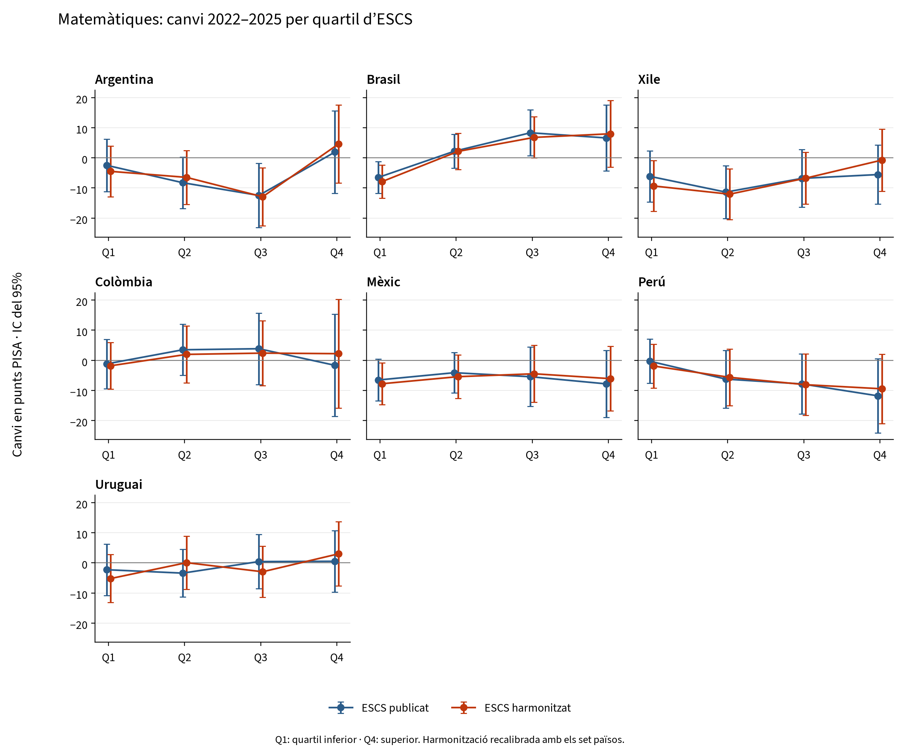
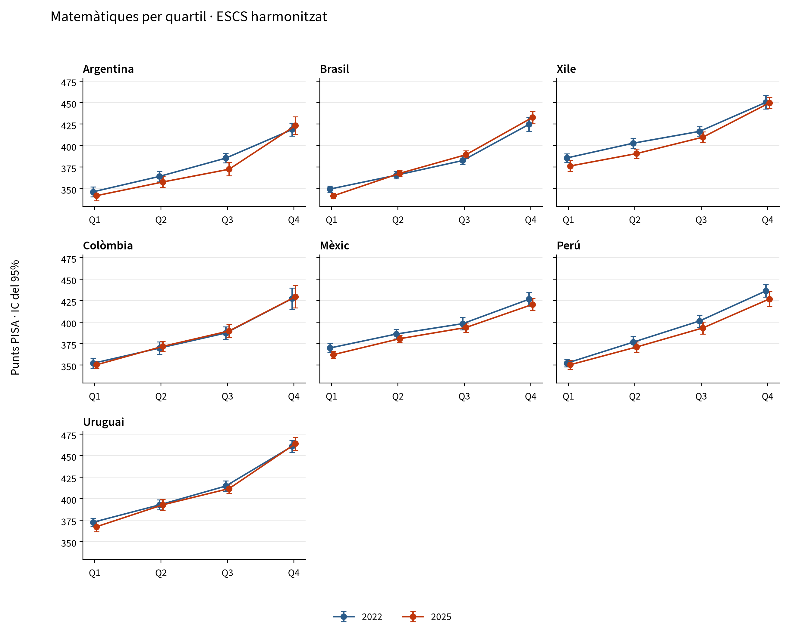

# Matemàtiques per quartil socioeconòmic a l’Amèrica Llatina

Comparació PISA 2022–2025. Països: Argentina, Brasil, Xile, Colòmbia, Mèxic, Perú, Uruguai.

Els set països tenen dades als dos cicles i entren en la calibració conjunta. Aquesta selecció no inclou tots els participants de la regió.

## Resultats principals

- **ESCS:** canvi mitjà de la bretxa Q4−Q1 de +1,1 [−4,0; +6,2] punts amb l’índex publicat i +5,7 [+0,5; +10,9] amb l’harmonitzat (IC del 95%).
- **HOMEPOS:** canvi mitjà de la bretxa Q4−Q1 de −16,0 [−20,8; −11,2] punts amb l’índex publicat i −1,7 [−6,4; +3,0] amb l’harmonitzat (IC del 95%).
- Amb l’ESCS harmonitzat, Q1 canvia −5,5 punts i Q4, +0,2 punts.
- Països amb un canvi de bretxa harmonitzada amb un IC del 95% que exclou el zero: Brasil.
- La menor cobertura de l’ESCS harmonitzat correspon a Argentina, 2025: 83,9% del pes de la mostra. Els casos complets permeten comparar els índexs sobre els mateixos alumnes, però no corregeixen possibles biaixos de no-resposta.

## Canvi de la bretxa Q4−Q1

Punts PISA; IC del 95% entre claudàtors. Un valor negatiu indica una reducció de la bretxa.

| País | ESCS publicat | ESCS harmonitzat |
|---|---|---|
| Argentina | +4,4 [−10,5; +19,3] | +9,1 [−5,3; +23,6] |
| Brasil | +13,1 [+1,8; +24,4] | +15,9 [+4,3; +27,5] |
| Xile | +0,6 [−12,0; +13,2] | +8,6 [−4,3; +21,5] |
| Colòmbia | −0,5 [−18,6; +17,7] | +4,0 [−15,1; +23,2] |
| Mèxic | −1,3 [−12,9; +10,4] | +1,7 [−10,0; +13,4] |
| Perú | −11,5 [−24,6; +1,5] | −7,6 [−20,1; +5,0] |
| Uruguai | +2,8 [−9,3; +14,9] | +8,2 [−4,0; +20,5] |
| Mitjana simple | +1,1 [−4,0; +6,2] | +5,7 [+0,5; +10,9] |

La mitjana dona el mateix pes a cada país.

## Canvis per quartil

| País | Índex | Q1 | Q2 | Q3 | Q4 |
|---|---|---|---|---|---|
| Argentina | ESCS publicat | −2,5 | −8,3 | −12,5 | +1,9 |
| Argentina | ESCS harmonitzat | −4,5 | −6,5 | −12,9 | +4,6 |
| Argentina | HOMEPOS publicat | −0,9 | −11,3 | −13,1 | −9,3 |
| Argentina | HOMEPOS harmonitzat | −8,8 | −13,0 | −11,9 | −0,4 |
| Brasil | ESCS publicat | −6,5 | +2,2 | +8,3 | +6,6 |
| Brasil | ESCS harmonitzat | −7,9 | +2,1 | +6,8 | +8,0 |
| Brasil | HOMEPOS publicat | +1,8 | −1,3 | +0,5 | −4,4 |
| Brasil | HOMEPOS harmonitzat | −4,2 | −2,5 | −0,1 | −0,6 |
| Xile | ESCS publicat | −6,2 | −11,4 | −6,8 | −5,6 |
| Xile | ESCS harmonitzat | −9,3 | −12,1 | −6,8 | −0,8 |
| Xile | HOMEPOS publicat | +2,3 | −7,6 | −13,4 | −17,8 |
| Xile | HOMEPOS harmonitzat | −6,3 | −10,9 | −13,2 | −4,8 |
| Colòmbia | ESCS publicat | −1,2 | +3,5 | +3,9 | −1,7 |
| Colòmbia | ESCS harmonitzat | −1,8 | +2,0 | +2,4 | +2,2 |
| Colòmbia | HOMEPOS publicat | +3,1 | +1,7 | −1,0 | −8,8 |
| Colòmbia | HOMEPOS harmonitzat | −2,0 | −0,3 | +1,4 | −5,3 |
| Mèxic | ESCS publicat | −6,5 | −4,1 | −5,4 | −7,8 |
| Mèxic | ESCS harmonitzat | −7,8 | −5,4 | −4,5 | −6,1 |
| Mèxic | HOMEPOS publicat | +2,2 | −6,5 | −7,0 | −17,8 |
| Mèxic | HOMEPOS harmonitzat | −6,5 | −5,1 | −9,5 | −9,5 |
| Perú | ESCS publicat | −0,3 | −6,2 | −7,8 | −11,8 |
| Perú | ESCS harmonitzat | −1,9 | −5,6 | −8,1 | −9,4 |
| Perú | HOMEPOS publicat | −2,7 | −3,1 | −10,6 | −17,8 |
| Perú | HOMEPOS harmonitzat | −7,1 | −8,1 | −8,4 | −12,9 |
| Uruguai | ESCS publicat | −2,3 | −3,4 | +0,4 | +0,5 |
| Uruguai | ESCS harmonitzat | −5,2 | +0,1 | −3,0 | +3,0 |
| Uruguai | HOMEPOS publicat | +14,3 | −3,4 | −6,8 | −16,1 |
| Uruguai | HOMEPOS harmonitzat | +4,4 | −6,0 | −5,6 | −8,6 |
| Mitjana simple | ESCS publicat | −3,6 | −4,0 | −2,9 | −2,5 |
| Mitjana simple | ESCS harmonitzat | −5,5 | −3,6 | −3,7 | +0,2 |
| Mitjana simple | HOMEPOS publicat | +2,8 | −4,5 | −7,4 | −13,1 |
| Mitjana simple | HOMEPOS harmonitzat | −4,4 | −6,6 | −6,8 | −6,0 |

## Nivells de matemàtiques el 2025

Punts PISA. Els errors estàndard i els intervals de confiança s’inclouen a l’Excel i a la taula de nivells.

| País | Índex | Q1 | Q2 | Q3 | Q4 | Bretxa Q4−Q1 |
|---|---|---|---|---|---|---|
| Argentina | ESCS publicat | 342,3 | 354,2 | 372,1 | 421,5 | 79,2 |
| Argentina | ESCS harmonitzat | 341,8 | 357,7 | 372,5 | 423,3 | 81,6 |
| Brasil | ESCS publicat | 341,6 | 367,2 | 387,8 | 432,0 | 90,4 |
| Brasil | ESCS harmonitzat | 341,6 | 367,7 | 389,4 | 432,8 | 91,2 |
| Xile | ESCS publicat | 377,6 | 392,0 | 408,3 | 447,3 | 69,7 |
| Xile | ESCS harmonitzat | 376,3 | 390,7 | 409,8 | 449,6 | 73,3 |
| Colòmbia | ESCS publicat | 350,5 | 373,2 | 388,1 | 428,6 | 78,1 |
| Colòmbia | ESCS harmonitzat | 350,3 | 371,8 | 389,8 | 429,6 | 79,2 |
| Mèxic | ESCS publicat | 362,7 | 381,7 | 392,3 | 419,8 | 57,2 |
| Mèxic | ESCS harmonitzat | 362,2 | 380,7 | 393,8 | 420,5 | 58,4 |
| Perú | ESCS publicat | 350,4 | 372,4 | 392,4 | 424,9 | 74,5 |
| Perú | ESCS harmonitzat | 350,4 | 371,1 | 393,3 | 426,9 | 76,5 |
| Uruguai | ESCS publicat | 368,9 | 390,4 | 412,0 | 462,4 | 93,4 |
| Uruguai | ESCS harmonitzat | 367,3 | 392,8 | 411,7 | 463,9 | 96,6 |

## Gràfics





## Mètode i interpretació

S’han extret els alumnes dels fitxers originals, incloent-hi els països no membres de l’OCDE. Els quartils es defineixen dins de cada país i any, amb aproximadament el 25% del pes final per grup i desempat aleatori amb llavor 7. Q1 i Q4 són posicions relatives nacionals, no nivells de renda idèntics entre països. Els cicles són mostres diferents, no un seguiment dels mateixos alumnes.

S’utilitzen deu valors plausibles i 80 rèpliques BRR amb Fay 0,5, recalculant els quartils a cada rèplica. La mitjana internacional suma les matrius de covariància nacionals independents i divideix pel nombre de països al quadrat, com a l’especificació principal en R. L’error d’enllaç d’1,220 punts s’afegeix una sola vegada als canvis de mitjanes, també a la mitjana internacional; es cancel·la en els canvis de bretxa. Els intervals són estimació ± 1,96 errors estàndard.

HOMEPOS harmonitzat utilitza els mateixos 16 ítems comuns, recodificacions i funcions Python del projecte: model 2PL/GPCM, calibració conjunta 2022+2025 amb el mateix pes per país-any i puntuacions WLE amb almenys deu respostes. ESCS combina HISEI, PARED (3→6 i 14,5→14) i HOMEPOS comú. Un únic component absent s’imputa per regressió dins del país-any amb un residu aleatori (llavor 20252022); els components s’estandarditzen conjuntament i se’n fa la mitjana amb pesos iguals.

**La calibració i l’estandardització s’han refet amb els set països.** Aquesta extensió regional no conserva exactament els resultats de la calibració OCDE del repositori i no constitueix una escala oficial de tendència de l’OCDE. Els errors estàndard són condicionals als índexs reconstruïts: no es recalibra l’IRT ni es repeteix la imputació dins de cada rèplica.

També s’inclouen HISEI, PARED, llibres a casa, el primer component principal i comparacions d’ESCS sobre els mateixos casos complets. La taula de l’efecte d’harmonització conserva la covariància entre índexs. Els intervals no estan ajustats per comparacions múltiples i els resultats descriptius no identifiquen efectes causals.

## Validació

Identificadors, pesos i valors plausibles alineats: comprovats. Desviació màxima respecte del 25% de pes per quartil: 0,048 punts percentuals.

240 cel·les contrastades amb el càlcul Python original; discrepància màxima 2.34e-13. 100 comprovacions de les mitjanes internacionals i els seus errors estàndard.

Diferència màxima respecte de les taules OCDE I.B1.2b.24 i I.B1.2b.38: 0,789 punts en les estimacions i 0,092 en els errors estàndard. Els empats, els procediments de variància i les revisions dels fitxers públics poden generar discrepàncies; es documenten sense forçar coincidències.

## Fitxers i reproducció

- [Excel](latam_mathematiques.xlsx)
- [CSV](tables/)
- [Versions i informes](index.md)
- [Sèries històriques de bretxes](history/README.md)
- [Fonts i configuració](sources.json)

```bash
.venv/bin/python code/python/scripts/14_latam_quartiles.py
.venv/bin/python code/python/scripts/16_latam_reports.py --current-only
```

El primer comandament requereix els originals del 2022 i del 2025 a `data/raw/` o `PISA_RAW_DIR`. El segon tradueix i representa les mateixes taules, sense recalcular estimacions. `--refresh` al primer comandament refà l’extracció i la calibració; les memòries cau són a `data/interim/python/latam/`.

## Fonts

Microdades oficials, còpies locals documentades a `data/README.md`: [PISA 2022](https://www.oecd.org/en/data/datasets/pisa-2022-database.html), [PISA 2025](https://www.oecd.org/en/data/datasets/pisa-2025-database.html). Descarregades el 18 de setembre de 2026. Portals consultats el 23 de setembre de 2026.

[OCDE / OECD](https://stat.link/k68msa). Les constants d’enllaç i els documents tècnics es descriuen a `reference/README.md`.
