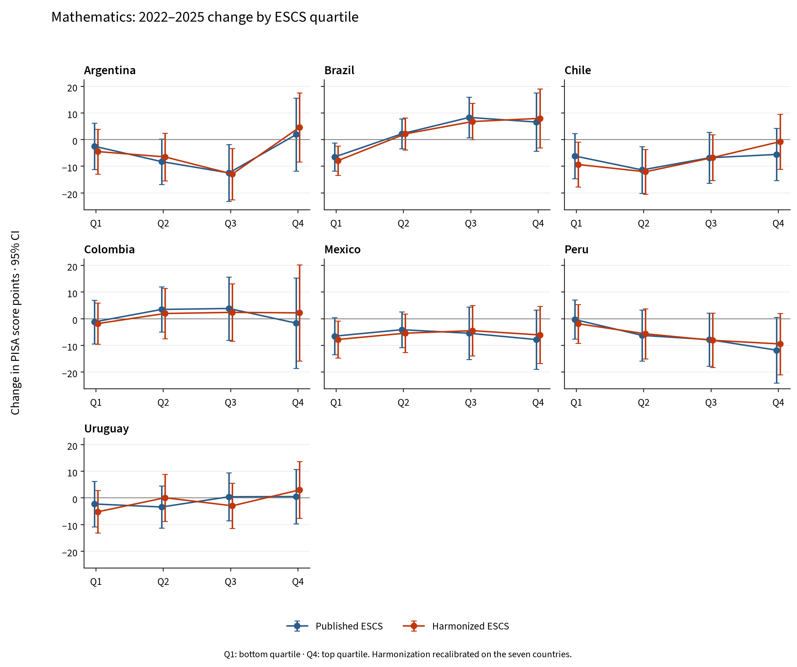
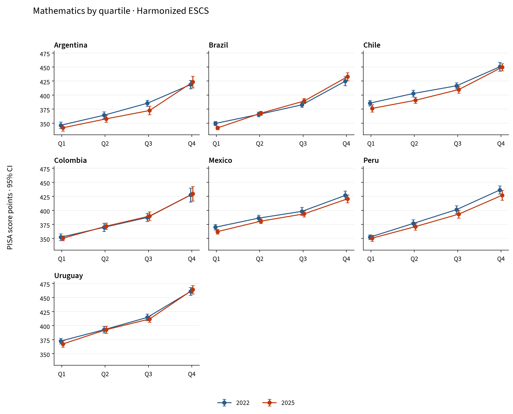

# Mathematics by socioeconomic quartile in Latin America

PISA 2022–2025 comparison. Countries: Argentina, Brazil, Chile, Colombia, Mexico, Peru, Uruguay.

All seven countries have data in both cycles and enter the pooled calibration. This selection does not comprise all participants in the region.

## Main findings

- **ESCS:** average change in the Q4−Q1 gap of +1.1 [−4.0; +6.2] points using the published index and +5.7 [+0.5; +10.9] using the harmonized index (95% CI).
- **HOMEPOS:** average change in the Q4−Q1 gap of −16.0 [−20.8; −11.2] points using the published index and −1.7 [−6.4; +3.0] using the harmonized index (95% CI).
- With harmonized ESCS, Q1 changes by −5.5 points and Q4 by +0.2 points.
- Countries whose harmonized gap change has a 95% CI excluding zero: Brazil.
- The lowest harmonized ESCS coverage is in Argentina, 2025: 83.9% of sample weight. Complete-case estimates compare the indices on the same students, but do not correct potential non-response bias.

## Change in the Q4−Q1 gap

PISA score points; 95% CIs in brackets. Negative values indicate a narrowing gap.

| Country | Published ESCS | Harmonized ESCS |
|---|---|---|
| Argentina | +4.4 [−10.5; +19.3] | +9.1 [−5.3; +23.6] |
| Brazil | +13.1 [+1.8; +24.4] | +15.9 [+4.3; +27.5] |
| Chile | +0.6 [−12.0; +13.2] | +8.6 [−4.3; +21.5] |
| Colombia | −0.5 [−18.6; +17.7] | +4.0 [−15.1; +23.2] |
| Mexico | −1.3 [−12.9; +10.4] | +1.7 [−10.0; +13.4] |
| Peru | −11.5 [−24.6; +1.5] | −7.6 [−20.1; +5.0] |
| Uruguay | +2.8 [−9.3; +14.9] | +8.2 [−4.0; +20.5] |
| Unweighted country average | +1.1 [−4.0; +6.2] | +5.7 [+0.5; +10.9] |

The average gives each country equal weight.

## Changes by quartile

| Country | Index | Q1 | Q2 | Q3 | Q4 |
|---|---|---|---|---|---|
| Argentina | Published ESCS | −2.5 | −8.3 | −12.5 | +1.9 |
| Argentina | Harmonized ESCS | −4.5 | −6.5 | −12.9 | +4.6 |
| Argentina | Published HOMEPOS | −0.9 | −11.3 | −13.1 | −9.3 |
| Argentina | Harmonized HOMEPOS | −8.8 | −13.0 | −11.9 | −0.4 |
| Brazil | Published ESCS | −6.5 | +2.2 | +8.3 | +6.6 |
| Brazil | Harmonized ESCS | −7.9 | +2.1 | +6.8 | +8.0 |
| Brazil | Published HOMEPOS | +1.8 | −1.3 | +0.5 | −4.4 |
| Brazil | Harmonized HOMEPOS | −4.2 | −2.5 | −0.1 | −0.6 |
| Chile | Published ESCS | −6.2 | −11.4 | −6.8 | −5.6 |
| Chile | Harmonized ESCS | −9.3 | −12.1 | −6.8 | −0.8 |
| Chile | Published HOMEPOS | +2.3 | −7.6 | −13.4 | −17.8 |
| Chile | Harmonized HOMEPOS | −6.3 | −10.9 | −13.2 | −4.8 |
| Colombia | Published ESCS | −1.2 | +3.5 | +3.9 | −1.7 |
| Colombia | Harmonized ESCS | −1.8 | +2.0 | +2.4 | +2.2 |
| Colombia | Published HOMEPOS | +3.1 | +1.7 | −1.0 | −8.8 |
| Colombia | Harmonized HOMEPOS | −2.0 | −0.3 | +1.4 | −5.3 |
| Mexico | Published ESCS | −6.5 | −4.1 | −5.4 | −7.8 |
| Mexico | Harmonized ESCS | −7.8 | −5.4 | −4.5 | −6.1 |
| Mexico | Published HOMEPOS | +2.2 | −6.5 | −7.0 | −17.8 |
| Mexico | Harmonized HOMEPOS | −6.5 | −5.1 | −9.5 | −9.5 |
| Peru | Published ESCS | −0.3 | −6.2 | −7.8 | −11.8 |
| Peru | Harmonized ESCS | −1.9 | −5.6 | −8.1 | −9.4 |
| Peru | Published HOMEPOS | −2.7 | −3.1 | −10.6 | −17.8 |
| Peru | Harmonized HOMEPOS | −7.1 | −8.1 | −8.4 | −12.9 |
| Uruguay | Published ESCS | −2.3 | −3.4 | +0.4 | +0.5 |
| Uruguay | Harmonized ESCS | −5.2 | +0.1 | −3.0 | +3.0 |
| Uruguay | Published HOMEPOS | +14.3 | −3.4 | −6.8 | −16.1 |
| Uruguay | Harmonized HOMEPOS | +4.4 | −6.0 | −5.6 | −8.6 |
| Unweighted country average | Published ESCS | −3.6 | −4.0 | −2.9 | −2.5 |
| Unweighted country average | Harmonized ESCS | −5.5 | −3.6 | −3.7 | +0.2 |
| Unweighted country average | Published HOMEPOS | +2.8 | −4.5 | −7.4 | −13.1 |
| Unweighted country average | Harmonized HOMEPOS | −4.4 | −6.6 | −6.8 | −6.0 |

## Mathematics score levels in 2025

PISA score points. Standard errors and confidence intervals are included in the workbook and the score-level table.

| Country | Index | Q1 | Q2 | Q3 | Q4 | Q4−Q1 gap |
|---|---|---|---|---|---|---|
| Argentina | Published ESCS | 342.3 | 354.2 | 372.1 | 421.5 | 79.2 |
| Argentina | Harmonized ESCS | 341.8 | 357.7 | 372.5 | 423.3 | 81.6 |
| Brazil | Published ESCS | 341.6 | 367.2 | 387.8 | 432.0 | 90.4 |
| Brazil | Harmonized ESCS | 341.6 | 367.7 | 389.4 | 432.8 | 91.2 |
| Chile | Published ESCS | 377.6 | 392.0 | 408.3 | 447.3 | 69.7 |
| Chile | Harmonized ESCS | 376.3 | 390.7 | 409.8 | 449.6 | 73.3 |
| Colombia | Published ESCS | 350.5 | 373.2 | 388.1 | 428.6 | 78.1 |
| Colombia | Harmonized ESCS | 350.3 | 371.8 | 389.8 | 429.6 | 79.2 |
| Mexico | Published ESCS | 362.7 | 381.7 | 392.3 | 419.8 | 57.2 |
| Mexico | Harmonized ESCS | 362.2 | 380.7 | 393.8 | 420.5 | 58.4 |
| Peru | Published ESCS | 350.4 | 372.4 | 392.4 | 424.9 | 74.5 |
| Peru | Harmonized ESCS | 350.4 | 371.1 | 393.3 | 426.9 | 76.5 |
| Uruguay | Published ESCS | 368.9 | 390.4 | 412.0 | 462.4 | 93.4 |
| Uruguay | Harmonized ESCS | 367.3 | 392.8 | 411.7 | 463.9 | 96.6 |

## Figures





## Method and interpretation

Students were extracted from the original files, including non-OECD countries. Quartiles are defined within each country and year, with approximately 25% of final student weight in each group and random tie-breaking with seed 7. Q1 and Q4 are national relative positions, not identical income levels across countries. Cycles are separate samples, not a panel of the same students.

Estimates use ten plausible values and 80 BRR replicates with Fay 0.5, recomputing quartiles in every replicate. The international mean sums independent national covariance matrices and divides by the squared number of countries, as in the main R specification. The 1.220-point linking error is added once to changes in means, including the international mean; it cancels in gap changes. Intervals are estimate ± 1.96 standard errors.

Harmonized HOMEPOS uses the same 16 common items, recodes and Python functions as the project: a 2PL/GPCM model, pooled 2022+2025 calibration with equal country-year weight, and WLE scores requiring at least ten answers. ESCS combines HISEI, PARED (3→6 and 14.5→14) and common-item HOMEPOS. A single missing component is imputed by within-country-year regression with a random residual (seed 20252022); components are standardized jointly and averaged with equal weights.

**Calibration and standardization have been refitted on the seven countries.** This regional extension does not exactly preserve the repository’s OECD-calibrated results and is not an official OECD trend scale. Standard errors are conditional on the reconstructed indices: IRT is not recalibrated and imputation is not repeated within each replicate.

The workbook also includes HISEI, PARED, books at home, the first principal component and ESCS comparisons on the same complete cases. The harmonization-effect table retains covariance between indices. Intervals are not adjusted for multiple comparisons, and descriptive results do not identify causal effects.

## Validation

Identifiers, weights and plausible-value alignment: checked. Maximum deviation from 25% weight per quartile: 0.048 percentage points.

240 cells checked against the original Python calculation; maximum discrepancy 2.34e-13. 100 checks of international means and their standard errors.

Maximum difference from OECD Tables I.B1.2b.24 and I.B1.2b.38: 0.789 score points in estimates and 0.092 in standard errors. Ties, variance procedures and public-file revisions can cause discrepancies; these are documented without forcing agreement.

## Files and reproduction

- [Excel](latam_mathematics.xlsx)
- [CSV](../tables/)
- [Report versions](../index.md)
- [Historical gap series](../history/en/README.md)
- [Sources and configuration](../sources.json)

```bash
.venv/bin/python code/python/scripts/14_latam_quartiles.py
.venv/bin/python code/python/scripts/16_latam_reports.py --current-only
```

The first command requires the 2022 and 2025 originals in `data/raw/` or `PISA_RAW_DIR`. The second translates and renders the same tables without re-estimating them. `--refresh` on the first command rebuilds extraction and calibration; caches are under `data/interim/python/latam/`.

## Sources

Official microdata, using local copies documented in `data/README.md`: [PISA 2022](https://www.oecd.org/en/data/datasets/pisa-2022-database.html), [PISA 2025](https://www.oecd.org/en/data/datasets/pisa-2025-database.html). Downloaded on 18 September 2026. Portals consulted on 23 September 2026.

[OCDE / OECD](https://stat.link/k68msa). Linking constants and technical documents are described in `reference/README.md`.
