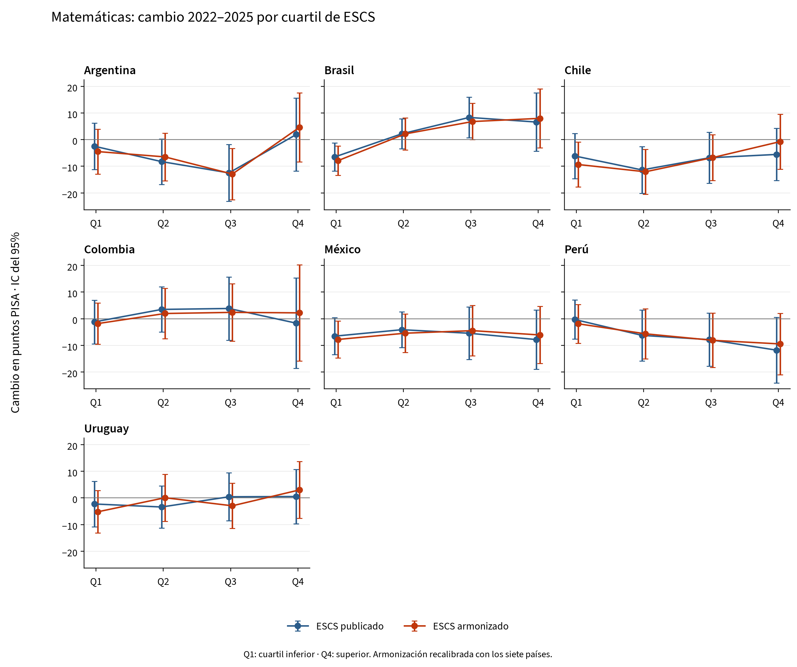
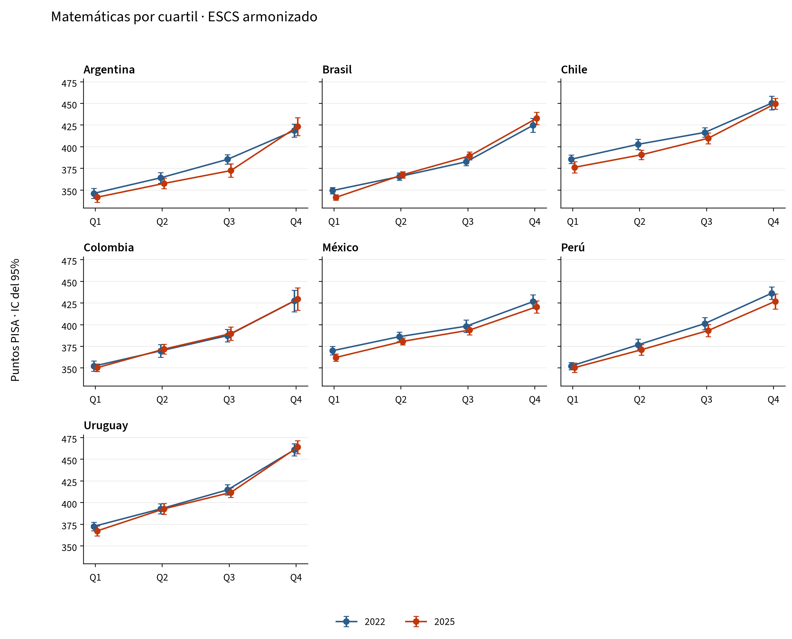

# Matemáticas por cuartil socioeconómico en América Latina

Comparación PISA 2022–2025. Países: Argentina, Brasil, Chile, Colombia, México, Perú, Uruguay.

Los siete países tienen datos en ambos ciclos y entran en la calibración conjunta. Esta selección no comprende todos los participantes de la región.

## Resultados principales

- **ESCS:** cambio medio de la brecha Q4−Q1 de +1,1 [−4,0; +6,2] puntos con el índice publicado y +5,7 [+0,5; +10,9] con el armonizado (IC del 95%).
- **HOMEPOS:** cambio medio de la brecha Q4−Q1 de −16,0 [−20,8; −11,2] puntos con el índice publicado y −1,7 [−6,4; +3,0] con el armonizado (IC del 95%).
- Con el ESCS armonizado, Q1 cambia −5,5 puntos y Q4, +0,2 puntos.
- Países cuyo cambio de brecha armonizada tiene un IC del 95% que excluye el cero: Brasil.
- La menor cobertura del ESCS armonizado corresponde a Argentina, 2025: 83,9% del peso de la muestra. Los casos completos permiten comparar los índices sobre los mismos alumnos, pero no corrigen posibles sesgos de no respuesta.

## Cambio de la brecha Q4−Q1

Puntos PISA; IC del 95% entre corchetes. Un valor negativo indica una reducción de la brecha.

| País | ESCS publicado | ESCS armonizado |
|---|---|---|
| Argentina | +4,4 [−10,5; +19,3] | +9,1 [−5,3; +23,6] |
| Brasil | +13,1 [+1,8; +24,4] | +15,9 [+4,3; +27,5] |
| Chile | +0,6 [−12,0; +13,2] | +8,6 [−4,3; +21,5] |
| Colombia | −0,5 [−18,6; +17,7] | +4,0 [−15,1; +23,2] |
| México | −1,3 [−12,9; +10,4] | +1,7 [−10,0; +13,4] |
| Perú | −11,5 [−24,6; +1,5] | −7,6 [−20,1; +5,0] |
| Uruguay | +2,8 [−9,3; +14,9] | +8,2 [−4,0; +20,5] |
| Media simple | +1,1 [−4,0; +6,2] | +5,7 [+0,5; +10,9] |

La media otorga el mismo peso a cada país.

## Cambios por cuartil

| País | Índice | Q1 | Q2 | Q3 | Q4 |
|---|---|---|---|---|---|
| Argentina | ESCS publicado | −2,5 | −8,3 | −12,5 | +1,9 |
| Argentina | ESCS armonizado | −4,5 | −6,5 | −12,9 | +4,6 |
| Argentina | HOMEPOS publicado | −0,9 | −11,3 | −13,1 | −9,3 |
| Argentina | HOMEPOS armonizado | −8,8 | −13,0 | −11,9 | −0,4 |
| Brasil | ESCS publicado | −6,5 | +2,2 | +8,3 | +6,6 |
| Brasil | ESCS armonizado | −7,9 | +2,1 | +6,8 | +8,0 |
| Brasil | HOMEPOS publicado | +1,8 | −1,3 | +0,5 | −4,4 |
| Brasil | HOMEPOS armonizado | −4,2 | −2,5 | −0,1 | −0,6 |
| Chile | ESCS publicado | −6,2 | −11,4 | −6,8 | −5,6 |
| Chile | ESCS armonizado | −9,3 | −12,1 | −6,8 | −0,8 |
| Chile | HOMEPOS publicado | +2,3 | −7,6 | −13,4 | −17,8 |
| Chile | HOMEPOS armonizado | −6,3 | −10,9 | −13,2 | −4,8 |
| Colombia | ESCS publicado | −1,2 | +3,5 | +3,9 | −1,7 |
| Colombia | ESCS armonizado | −1,8 | +2,0 | +2,4 | +2,2 |
| Colombia | HOMEPOS publicado | +3,1 | +1,7 | −1,0 | −8,8 |
| Colombia | HOMEPOS armonizado | −2,0 | −0,3 | +1,4 | −5,3 |
| México | ESCS publicado | −6,5 | −4,1 | −5,4 | −7,8 |
| México | ESCS armonizado | −7,8 | −5,4 | −4,5 | −6,1 |
| México | HOMEPOS publicado | +2,2 | −6,5 | −7,0 | −17,8 |
| México | HOMEPOS armonizado | −6,5 | −5,1 | −9,5 | −9,5 |
| Perú | ESCS publicado | −0,3 | −6,2 | −7,8 | −11,8 |
| Perú | ESCS armonizado | −1,9 | −5,6 | −8,1 | −9,4 |
| Perú | HOMEPOS publicado | −2,7 | −3,1 | −10,6 | −17,8 |
| Perú | HOMEPOS armonizado | −7,1 | −8,1 | −8,4 | −12,9 |
| Uruguay | ESCS publicado | −2,3 | −3,4 | +0,4 | +0,5 |
| Uruguay | ESCS armonizado | −5,2 | +0,1 | −3,0 | +3,0 |
| Uruguay | HOMEPOS publicado | +14,3 | −3,4 | −6,8 | −16,1 |
| Uruguay | HOMEPOS armonizado | +4,4 | −6,0 | −5,6 | −8,6 |
| Media simple | ESCS publicado | −3,6 | −4,0 | −2,9 | −2,5 |
| Media simple | ESCS armonizado | −5,5 | −3,6 | −3,7 | +0,2 |
| Media simple | HOMEPOS publicado | +2,8 | −4,5 | −7,4 | −13,1 |
| Media simple | HOMEPOS armonizado | −4,4 | −6,6 | −6,8 | −6,0 |

## Niveles de matemáticas en 2025

Puntos PISA. Los errores estándar e intervalos se incluyen en el Excel y en la tabla de niveles.

| País | Índice | Q1 | Q2 | Q3 | Q4 | Brecha Q4−Q1 |
|---|---|---|---|---|---|---|
| Argentina | ESCS publicado | 342,3 | 354,2 | 372,1 | 421,5 | 79,2 |
| Argentina | ESCS armonizado | 341,8 | 357,7 | 372,5 | 423,3 | 81,6 |
| Brasil | ESCS publicado | 341,6 | 367,2 | 387,8 | 432,0 | 90,4 |
| Brasil | ESCS armonizado | 341,6 | 367,7 | 389,4 | 432,8 | 91,2 |
| Chile | ESCS publicado | 377,6 | 392,0 | 408,3 | 447,3 | 69,7 |
| Chile | ESCS armonizado | 376,3 | 390,7 | 409,8 | 449,6 | 73,3 |
| Colombia | ESCS publicado | 350,5 | 373,2 | 388,1 | 428,6 | 78,1 |
| Colombia | ESCS armonizado | 350,3 | 371,8 | 389,8 | 429,6 | 79,2 |
| México | ESCS publicado | 362,7 | 381,7 | 392,3 | 419,8 | 57,2 |
| México | ESCS armonizado | 362,2 | 380,7 | 393,8 | 420,5 | 58,4 |
| Perú | ESCS publicado | 350,4 | 372,4 | 392,4 | 424,9 | 74,5 |
| Perú | ESCS armonizado | 350,4 | 371,1 | 393,3 | 426,9 | 76,5 |
| Uruguay | ESCS publicado | 368,9 | 390,4 | 412,0 | 462,4 | 93,4 |
| Uruguay | ESCS armonizado | 367,3 | 392,8 | 411,7 | 463,9 | 96,6 |

## Gráficos





## Método e interpretación

Se han extraído los alumnos de los ficheros originales, incluidos los países no miembros de la OCDE. Los cuartiles se definen dentro de cada país y año, con aproximadamente el 25% del peso final en cada grupo y desempate aleatorio con semilla 7. Q1 y Q4 son posiciones relativas nacionales, no niveles de renta idénticos entre países. Los ciclos son muestras distintas, no un seguimiento de los mismos alumnos.

Se utilizan diez valores plausibles y 80 réplicas BRR con Fay 0,5, recalculando los cuartiles en cada réplica. La media internacional suma las matrices de covarianza nacionales independientes y divide por el número de países al cuadrado, como en la especificación principal en R. El error de enlace de 1,220 puntos se añade una sola vez a los cambios de medias, también a la media internacional; se cancela en los cambios de brecha. Los intervalos son estimación ± 1,96 errores estándar.

HOMEPOS armonizado utiliza los mismos 16 ítems comunes, recodificaciones y funciones Python del proyecto: modelo 2PL/GPCM, calibración conjunta 2022+2025 con igual peso por país-año y puntuaciones WLE con al menos diez respuestas. ESCS combina HISEI, PARED (3→6 y 14,5→14) y HOMEPOS común. Un único componente ausente se imputa por regresión dentro del país-año con un residuo aleatorio (semilla 20252022); los componentes se estandarizan conjuntamente y se promedian con igual peso.

**La calibración y la estandarización se han rehecho con los siete países.** Esta extensión regional no conserva exactamente los resultados de la calibración OCDE del repositorio y no constituye una escala oficial de tendencia de la OCDE. Los errores estándar son condicionales a los índices reconstruidos: no se recalibra el IRT ni se repite la imputación dentro de cada réplica.

También se incluyen HISEI, PARED, libros en casa, el primer componente principal y comparaciones de ESCS sobre los mismos casos completos. La tabla del efecto de armonización conserva la covarianza entre índices. Los intervalos no están ajustados por comparaciones múltiples y los resultados descriptivos no identifican efectos causales.

## Validación

Identificadores, pesos y valores plausibles alineados: comprobados. Desviación máxima respecto al 25% de peso por cuartil: 0,048 puntos porcentuales.

240 celdas contrastadas con el cálculo Python original; discrepancia máxima 2.34e-13. 100 comprobaciones de las medias internacionales y sus errores estándar.

Diferencia máxima frente a las tablas OCDE I.B1.2b.24 e I.B1.2b.38: 0,789 puntos en las estimaciones y 0,092 en los errores estándar. Los empates, los procedimientos de varianza y las revisiones de los ficheros públicos pueden generar discrepancias; se documentan sin forzar coincidencias.

## Archivos y reproducción

- [Excel](latam_mathematics.xlsx)
- [CSV](../tables/)
- [Versiones e informes](../index.md)
- [Series históricas de brechas](../history/es/README.md)
- [Fuentes y configuración](../sources.json)

```bash
.venv/bin/python code/python/scripts/14_latam_quartiles.py
.venv/bin/python code/python/scripts/16_latam_reports.py --current-only
```

El primer comando requiere los originales de 2022 y 2025 en `data/raw/` o `PISA_RAW_DIR`. El segundo traduce y representa las mismas tablas, sin recalcular estimaciones. `--refresh` en el primer comando rehace la extracción y calibración; las cachés están en `data/interim/python/latam/`.

## Fuentes

Microdatos oficiales, copias locales documentadas en `data/README.md`: [PISA 2022](https://www.oecd.org/en/data/datasets/pisa-2022-database.html), [PISA 2025](https://www.oecd.org/en/data/datasets/pisa-2025-database.html). Descargados el 18 de septiembre de 2026. Portales consultados el 23 de septiembre de 2026.

[OCDE / OECD](https://stat.link/k68msa). Las constantes de enlace y los documentos técnicos están descritos en `reference/README.md`.
