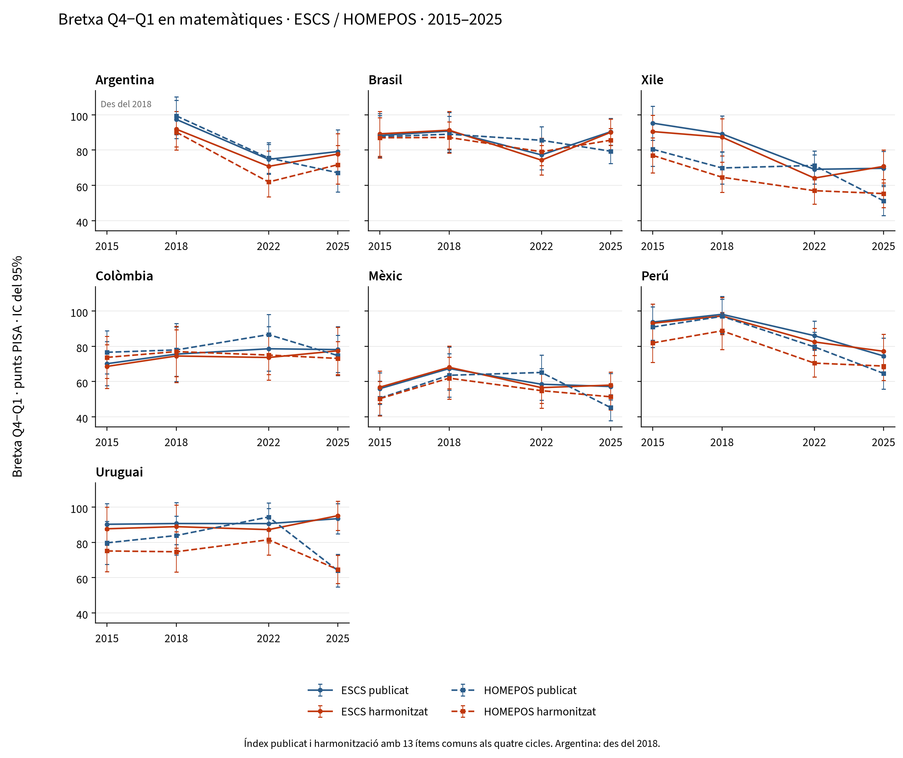

# Evolució de la bretxa Q4−Q1 en matemàtiques, 2015–2025

Argentina, Brasil, Xile, Colòmbia, Mèxic, Perú, Uruguai.

Es mostra la **bretxa Q4−Q1 de matemàtiques a cada cicle**, amb l’índex publicat i el nostre índex harmonitzat, tant per a ESCS com per a HOMEPOS. Cada punt és la puntuació mitjana del quartil superior menys la de l’inferior. Es representa el nivell d’aquesta bretxa, en punts PISA, sense calcular-ne el canvi entre anys, seguint `fig_gap_series_math.png` del projecte.

## Cobertura temporal

| País | Cicles inclosos |
|---|---|
| Argentina | 2018, 2022, 2025 |
| Brasil | 2015, 2018, 2022, 2025 |
| Xile | 2015, 2018, 2022, 2025 |
| Colòmbia | 2015, 2018, 2022, 2025 |
| Mèxic | 2015, 2018, 2022, 2025 |
| Perú | 2015, 2018, 2022, 2025 |
| Uruguai | 2015, 2018, 2022, 2025 |

**Argentina comença el 2018.** L’OCDE considera que els resultats nacionals del 2015 no són comparables per un marc mostral incomplet. No se substitueix Argentina per la Ciutat Autònoma de Buenos Aires ni s’interpola el 2015. [OCDE / OECD](https://www.oecd.org/en/publications/pisa-2018-results-volume-i_5f07c754-en/full-report/component-9.html).

## Gràfics



Blau: índex publicat. Taronja: harmonitzat. Línia contínua: ESCS. Línia discontínua: HOMEPOS. Barres: intervals de confiança del 95%.

Versions separades: [ESCS](figures/fig_gap_series_escs_math.png) i [HOMEPOS](figures/fig_gap_series_homepos_math.png). Tots els gràfics també estan disponibles en PDF.

## ESCS

Bretxa Q4−Q1 en punts PISA. Els errors estàndard i els intervals del 95% són a l’Excel i als CSV.

| País | Índex | 2015 | 2018 | 2022 | 2025 |
|---|---|---|---|---|---|
| Argentina | ESCS publicat | — | 97,4 | 74,8 | 79,2 |
| Argentina | ESCS harmonitzat | — | 91,9 | 70,8 | 77,8 |
| Brasil | ESCS publicat | 88,3 | 90,8 | 77,3 | 90,4 |
| Brasil | ESCS harmonitzat | 89,2 | 91,3 | 74,3 | 90,1 |
| Xile | ESCS publicat | 95,3 | 89,2 | 69,1 | 69,7 |
| Xile | ESCS harmonitzat | 90,5 | 87,3 | 64,1 | 70,8 |
| Colòmbia | ESCS publicat | 70,1 | 75,5 | 78,6 | 78,1 |
| Colòmbia | ESCS harmonitzat | 68,6 | 74,5 | 73,6 | 77,4 |
| Mèxic | ESCS publicat | 56,0 | 67,3 | 58,5 | 57,2 |
| Mèxic | ESCS harmonitzat | 56,8 | 68,1 | 56,5 | 58,0 |
| Perú | ESCS publicat | 93,7 | 98,1 | 86,0 | 74,5 |
| Perú | ESCS harmonitzat | 93,0 | 97,1 | 82,4 | 77,1 |
| Uruguai | ESCS publicat | 90,2 | 90,7 | 90,6 | 93,4 |
| Uruguai | ESCS harmonitzat | 87,7 | 88,9 | 87,2 | 95,1 |

## HOMEPOS

Bretxa Q4−Q1 en punts PISA. Els errors estàndard i els intervals del 95% són a l’Excel i als CSV.

| País | Índex | 2015 | 2018 | 2022 | 2025 |
|---|---|---|---|---|---|
| Argentina | HOMEPOS publicat | — | 99,4 | 75,6 | 67,2 |
| Argentina | HOMEPOS harmonitzat | — | 90,2 | 61,9 | 71,7 |
| Brasil | HOMEPOS publicat | 87,6 | 89,0 | 85,6 | 79,4 |
| Brasil | HOMEPOS harmonitzat | 87,0 | 87,2 | 79,1 | 85,6 |
| Xile | HOMEPOS publicat | 80,5 | 69,9 | 71,3 | 51,2 |
| Xile | HOMEPOS harmonitzat | 77,0 | 64,6 | 57,0 | 55,4 |
| Colòmbia | HOMEPOS publicat | 76,6 | 77,9 | 86,6 | 74,7 |
| Colòmbia | HOMEPOS harmonitzat | 73,7 | 77,0 | 75,0 | 73,1 |
| Mèxic | HOMEPOS publicat | 50,5 | 63,5 | 65,1 | 45,2 |
| Mèxic | HOMEPOS harmonitzat | 50,3 | 61,9 | 54,8 | 51,3 |
| Perú | HOMEPOS publicat | 90,9 | 96,9 | 79,6 | 64,6 |
| Perú | HOMEPOS harmonitzat | 81,9 | 88,7 | 70,4 | 68,8 |
| Uruguai | HOMEPOS publicat | 79,7 | 83,9 | 94,4 | 64,0 |
| Uruguai | HOMEPOS harmonitzat | 75,1 | 74,7 | 81,5 | 64,6 |

## Mètode i interpretació

S’utilitzen els deu valors plausibles de matemàtiques i els pesos finals oficials. Cada quartil reuneix aproximadament el 25% del pes dels alumnes amb índex i valors plausibles vàlids al seu país i cicle. Els quartils es recalculen amb cadascuna de les 80 rèpliques BRR (Fay 0,5); els empats es resolen amb llavor 7. Els errors estàndard combinen variància mostral i variància entre valors plausibles, conservant la covariància entre Q1 i Q4 en calcular la bretxa. Calen almenys 200 alumnes vàlids per índex i país-any.

**Índex publicat:** ESCS i HOMEPOS tal com apareixen al fitxer original de cada cicle, sense aplicar reescalats retrospectius. La seva definició pot canviar amb el qüestionari.

**El nostre índex harmonitzat:** HOMEPOS es reconstrueix amb els 13 ítems comuns als quatre cicles, recodificats a categories comparables, mitjançant un model 2PL/GPCM amb paràmetres únics. La calibració conjunta dona el mateix pes total a cadascuna de les 27 combinacions país-any disponibles; les puntuacions WLE requereixen almenys vuit respostes. A l’ítem d’ordinadors es conserva com a absent la combinació «cap + resposta desconeguda», seguint la correcció de la implementació R del projecte.

ESCS combina HISEI, PARED i l’HOMEPOS comú. L’educació parental del 2015 es reconstrueix des d’HISCED amb la correspondència modal observada el 2018, i PARED es recodifica amb 3→6 i 14,5→14 anys. Un únic component absent s’imputa per regressió dins del país-any, afegint-hi un residu aleatori amb llavor 20252022. Els tres components s’estandarditzen en el conjunt dels quatre cicles, amb el mateix pes total per país-any, se’n fa la mitjana amb pesos iguals i el resultat es torna a estandarditzar.

**L’harmonització històrica utilitza 13 ítems i els quatre cicles; la comparació 2022–2025 utilitza 16 ítems i dos cicles.** Per això, els resultats harmonitzats del 2022 i del 2025 poden diferir entre tots dos informes. Tota la corba històrica s’estima amb una única especificació comuna. La reconstrucció és regional i no constitueix una escala oficial de tendència de l’OCDE. Els errors estàndard són condicionals als índexs reconstruïts: el model IRT i la imputació no es tornen a estimar a les rèpliques.

Els intervals són estimació ± 1,96 errors estàndard. L’error additiu d’enllaç de l’escala de rendiment es cancel·la en el contrast Q4−Q1 del mateix cicle. El solapament visual dels intervals no és una prova del canvi entre anys. Q1 i Q4 representen posicions relatives dins de cada país; la sèrie no segueix els mateixos alumnes ni un grup socioeconòmic fix, i no identifica efectes causals. Es presenten resultats nacionals; no es calcula una mitjana regional amb una composició que canviï entre cicles.

## Validació

La sèrie conté 27 combinacions país-any, 108 bretxes i 432 estimacions per quartil i índex. Identificadors, pesos, valors plausibles, mides de grup, mitjanes ponderades i Q4−Q1: comprovats.

El model IRT va convergir en 41 iteracions, amb 252601 alumnes al conjunt de calibració. Els paràmetres complets són a `irt_parameters.csv` i la configuració a `sources.json`.

112 nivells dels índexs publicats del 2022 i del 2025 reprodueixen l’anàlisi anterior; discrepància màxima: 5.68e-14 punts.

La comparació amb les taules OCDE I.B1.2b.24 i I.B1.2b.38 es conserva a `official_comparison.csv`. El 2015 i el 2018, aquestes taules retrospectives poden utilitzar índexs reescalats: no són un objectiu d’igualtat per als quartils de l’índex original. Les diferències es documenten per país i cicle.

## Fitxers i reproducció

- [Excel](historical_mathematics.xlsx)
- [CSV](tables/)
- [Versions i informes](../index.md)
- [Fonts i empremtes SHA-256](sources.json)

```bash
.venv/bin/python code/python/scripts/15_latam_history.py
.venv/bin/python code/python/scripts/16_latam_reports.py
```

Calen els originals del 2015, 2018, 2022 i 2025 a `data/raw/` o `PISA_RAW_DIR`. Els extractes i memòries cau es guarden a `data/interim/python/latam/history/`. Les versions lingüístiques representen exactament les mateixes taules numèriques.

## Fonts

[PISA 2015](https://www.oecd.org/en/data/datasets/pisa-2015-database.html), [PISA 2018](https://www.oecd.org/en/data/datasets/pisa-2018-database.html), [PISA 2022](https://www.oecd.org/en/data/datasets/pisa-2022-database.html), [PISA 2025](https://www.oecd.org/en/data/datasets/pisa-2025-database.html).

S’han reutilitzat els fitxers oficials disponibles localment, documentats a `data/README.md`. Els portals i l’advertiment sobre Argentina 2015 es van consultar el 23 de setembre de 2026.
