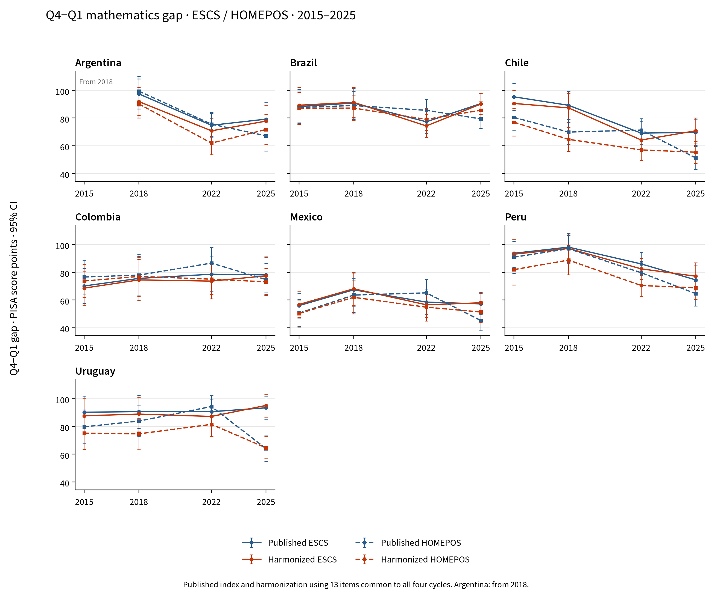

# Q4−Q1 mathematics gap over time, 2015–2025

Argentina, Brazil, Chile, Colombia, Mexico, Peru, Uruguay.

The series show the **Q4−Q1 mathematics gap in each cycle**, using the published index and our harmonized index, for both ESCS and HOMEPOS. Each point is the mean score in the top quartile minus the mean in the bottom quartile. Charts plot the level of that gap in PISA score points, without calculating changes between years, following the project's `fig_gap_series_math.png`.

## Time coverage

| Country | Included cycles |
|---|---|
| Argentina | 2018, 2022, 2025 |
| Brazil | 2015, 2018, 2022, 2025 |
| Chile | 2015, 2018, 2022, 2025 |
| Colombia | 2015, 2018, 2022, 2025 |
| Mexico | 2015, 2018, 2022, 2025 |
| Peru | 2015, 2018, 2022, 2025 |
| Uruguay | 2015, 2018, 2022, 2025 |

**Argentina starts in 2018.** OECD considers the 2015 national results non-comparable because of an incomplete sampling frame. Argentina is not replaced by the City of Buenos Aires, and 2015 is not interpolated. [OCDE / OECD](https://www.oecd.org/en/publications/pisa-2018-results-volume-i_5f07c754-en/full-report/component-9.html).

## Figures



Blue: published index. Orange: harmonized index. Solid line: ESCS. Dashed line: HOMEPOS. Bars: 95% confidence intervals.

Separate charts: [ESCS](figures/fig_gap_series_escs_math.png) and [HOMEPOS](figures/fig_gap_series_homepos_math.png). All charts are also available as PDFs.

## ESCS

Q4−Q1 gap in PISA score points. Standard errors and 95% intervals are in the workbook and CSV tables.

| Country | Index | 2015 | 2018 | 2022 | 2025 |
|---|---|---|---|---|---|
| Argentina | Published ESCS | — | 97.4 | 74.8 | 79.2 |
| Argentina | Harmonized ESCS | — | 91.9 | 70.8 | 77.8 |
| Brazil | Published ESCS | 88.3 | 90.8 | 77.3 | 90.4 |
| Brazil | Harmonized ESCS | 89.2 | 91.3 | 74.3 | 90.1 |
| Chile | Published ESCS | 95.3 | 89.2 | 69.1 | 69.7 |
| Chile | Harmonized ESCS | 90.5 | 87.3 | 64.1 | 70.8 |
| Colombia | Published ESCS | 70.1 | 75.5 | 78.6 | 78.1 |
| Colombia | Harmonized ESCS | 68.6 | 74.5 | 73.6 | 77.4 |
| Mexico | Published ESCS | 56.0 | 67.3 | 58.5 | 57.2 |
| Mexico | Harmonized ESCS | 56.8 | 68.1 | 56.5 | 58.0 |
| Peru | Published ESCS | 93.7 | 98.1 | 86.0 | 74.5 |
| Peru | Harmonized ESCS | 93.0 | 97.1 | 82.4 | 77.1 |
| Uruguay | Published ESCS | 90.2 | 90.7 | 90.6 | 93.4 |
| Uruguay | Harmonized ESCS | 87.7 | 88.9 | 87.2 | 95.1 |

## HOMEPOS

Q4−Q1 gap in PISA score points. Standard errors and 95% intervals are in the workbook and CSV tables.

| Country | Index | 2015 | 2018 | 2022 | 2025 |
|---|---|---|---|---|---|
| Argentina | Published HOMEPOS | — | 99.4 | 75.6 | 67.2 |
| Argentina | Harmonized HOMEPOS | — | 90.2 | 61.9 | 71.7 |
| Brazil | Published HOMEPOS | 87.6 | 89.0 | 85.6 | 79.4 |
| Brazil | Harmonized HOMEPOS | 87.0 | 87.2 | 79.1 | 85.6 |
| Chile | Published HOMEPOS | 80.5 | 69.9 | 71.3 | 51.2 |
| Chile | Harmonized HOMEPOS | 77.0 | 64.6 | 57.0 | 55.4 |
| Colombia | Published HOMEPOS | 76.6 | 77.9 | 86.6 | 74.7 |
| Colombia | Harmonized HOMEPOS | 73.7 | 77.0 | 75.0 | 73.1 |
| Mexico | Published HOMEPOS | 50.5 | 63.5 | 65.1 | 45.2 |
| Mexico | Harmonized HOMEPOS | 50.3 | 61.9 | 54.8 | 51.3 |
| Peru | Published HOMEPOS | 90.9 | 96.9 | 79.6 | 64.6 |
| Peru | Harmonized HOMEPOS | 81.9 | 88.7 | 70.4 | 68.8 |
| Uruguay | Published HOMEPOS | 79.7 | 83.9 | 94.4 | 64.0 |
| Uruguay | Harmonized HOMEPOS | 75.1 | 74.7 | 81.5 | 64.6 |

## Method and interpretation

Estimates use all ten mathematics plausible values and official final weights. Each quartile contains approximately 25% of the weight of students with a valid index and plausible values in its country and cycle. Quartiles are recomputed for each of the 80 BRR replicates (Fay 0.5); ties are broken using seed 7. Standard errors combine sampling and between-plausible-value variance, retaining the covariance between Q1 and Q4 when calculating the gap. At least 200 valid students are required for each index and country-year.

**Published index:** ESCS and HOMEPOS as released in each cycle’s original file, with no retrospective rescaling. Their definitions may change with the questionnaire.

**Our harmonized index:** HOMEPOS is rebuilt from the 13 items common to all four cycles, recoded to comparable categories, using one set of 2PL/GPCM parameters. Pooled calibration gives equal total weight to each of the 27 available country-year cells; WLE scores require at least eight answers. For the computer item, a combination of “none + unknown response” remains missing, following the correction in the project's R implementation.

ESCS combines HISEI, PARED and common-item HOMEPOS. Parental education in 2015 is reconstructed from HISCED using the modal mapping observed in 2018, and PARED is recoded with 3→6 and 14.5→14 years. A single missing component is imputed by within-country-year regression, adding a random residual with seed 20252022. The three components are standardized across the four-cycle pool with equal country-year weight, averaged with equal component weights, and the result is standardized again.

**Historical harmonization uses 13 items and all four cycles; the 2022–2025 comparison uses 16 items and two cycles.** Harmonized results for 2022 and 2025 can therefore differ between the two reports. The entire historical curve uses one common specification. This is a regional reconstruction, not an official OECD trend scale. Standard errors are conditional on the reconstructed indices: IRT and imputation are not re-estimated in the replicates.

Intervals are estimate ± 1.96 standard errors. The additive achievement-scale linking error cancels in the within-cycle Q4−Q1 contrast. Visual overlap of intervals is not a test of change between years. Q1 and Q4 represent relative positions within each country; the series does not follow the same students or a fixed socioeconomic group and does not identify causal effects. Results are national; no regional average with changing country coverage is calculated.

## Validation

The series contains 27 country-year cells, 108 gaps and 432 quartile/index estimates. Identifiers, weights, plausible values, group sizes, weighted means and Q4−Q1: checked.

The IRT model converged in 41 iterations, with 252601 students in the calibration pool. Full parameters are in `irt_parameters.csv` and settings in `sources.json`.

112 score levels based on the published indices in 2022 and 2025 reproduce the previous analysis; maximum discrepancy: 5.68e-14 points.

Comparison with OECD Tables I.B1.2b.24 and I.B1.2b.38 is retained in `official_comparison.csv`. For 2015 and 2018, these retrospective tables may use rescaled indices, so they are not an equality target for quartiles of the original index. Differences are documented by country and cycle.

## Files and reproduction

- [Excel](historical_mathematics.xlsx)
- [CSV](../tables/)
- [Report versions](../../index.md)
- [Sources and SHA-256 fingerprints](../sources.json)

```bash
.venv/bin/python code/python/scripts/15_latam_history.py
.venv/bin/python code/python/scripts/16_latam_reports.py
```

The 2015, 2018, 2022 and 2025 originals must be in `data/raw/` or `PISA_RAW_DIR`. Extracts and caches are stored under `data/interim/python/latam/history/`. Language versions render exactly the same numerical tables.

## Sources

[PISA 2015](https://www.oecd.org/en/data/datasets/pisa-2015-database.html), [PISA 2018](https://www.oecd.org/en/data/datasets/pisa-2018-database.html), [PISA 2022](https://www.oecd.org/en/data/datasets/pisa-2022-database.html), [PISA 2025](https://www.oecd.org/en/data/datasets/pisa-2025-database.html).

The locally available official files documented in `data/README.md` were reused. Portals and the Argentina 2015 comparability note were checked on 23 September 2026.
