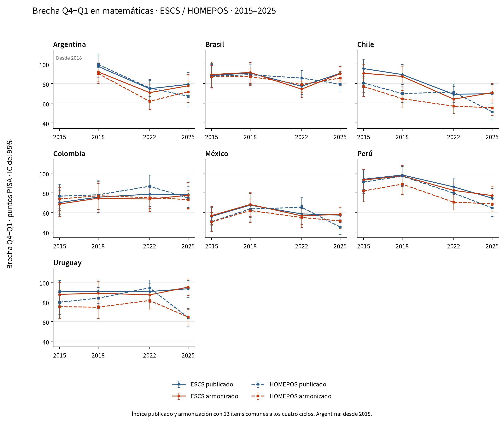

# Evolución de la brecha Q4−Q1 en matemáticas, 2015–2025

Argentina, Brasil, Chile, Colombia, México, Perú, Uruguay.

Se muestra la **brecha Q4−Q1 de matemáticas en cada ciclo**, con el índice publicado y nuestro índice armonizado, tanto para ESCS como para HOMEPOS. Cada punto es la puntuación media del cuartil superior menos la del inferior. Se representa el nivel de esa brecha, en puntos PISA, sin calcular su cambio entre años, siguiendo `fig_gap_series_math.png` del proyecto.

## Cobertura temporal

| País | Ciclos incluidos |
|---|---|
| Argentina | 2018, 2022, 2025 |
| Brasil | 2015, 2018, 2022, 2025 |
| Chile | 2015, 2018, 2022, 2025 |
| Colombia | 2015, 2018, 2022, 2025 |
| México | 2015, 2018, 2022, 2025 |
| Perú | 2015, 2018, 2022, 2025 |
| Uruguay | 2015, 2018, 2022, 2025 |

**Argentina empieza en 2018.** La OCDE considera que los resultados nacionales de 2015 no son comparables debido a un marco muestral incompleto. No se sustituye Argentina por la Ciudad Autónoma de Buenos Aires ni se interpola 2015. [OCDE / OECD](https://www.oecd.org/en/publications/pisa-2018-results-volume-i_5f07c754-en/full-report/component-9.html).

## Gráficos



Azul: índice publicado. Naranja: armonizado. Línea continua: ESCS. Línea discontinua: HOMEPOS. Barras: intervalos de confianza del 95%.

Versiones separadas: [ESCS](figures/fig_gap_series_escs_math.png) y [HOMEPOS](figures/fig_gap_series_homepos_math.png). Todos los gráficos están disponibles también en PDF.

## ESCS

Brecha Q4−Q1 en puntos PISA. Los errores estándar y los intervalos del 95% están en el Excel y en los CSV.

| País | Índice | 2015 | 2018 | 2022 | 2025 |
|---|---|---|---|---|---|
| Argentina | ESCS publicado | — | 97,4 | 74,8 | 79,2 |
| Argentina | ESCS armonizado | — | 91,9 | 70,8 | 77,8 |
| Brasil | ESCS publicado | 88,3 | 90,8 | 77,3 | 90,4 |
| Brasil | ESCS armonizado | 89,2 | 91,3 | 74,3 | 90,1 |
| Chile | ESCS publicado | 95,3 | 89,2 | 69,1 | 69,7 |
| Chile | ESCS armonizado | 90,5 | 87,3 | 64,1 | 70,8 |
| Colombia | ESCS publicado | 70,1 | 75,5 | 78,6 | 78,1 |
| Colombia | ESCS armonizado | 68,6 | 74,5 | 73,6 | 77,4 |
| México | ESCS publicado | 56,0 | 67,3 | 58,5 | 57,2 |
| México | ESCS armonizado | 56,8 | 68,1 | 56,5 | 58,0 |
| Perú | ESCS publicado | 93,7 | 98,1 | 86,0 | 74,5 |
| Perú | ESCS armonizado | 93,0 | 97,1 | 82,4 | 77,1 |
| Uruguay | ESCS publicado | 90,2 | 90,7 | 90,6 | 93,4 |
| Uruguay | ESCS armonizado | 87,7 | 88,9 | 87,2 | 95,1 |

## HOMEPOS

Brecha Q4−Q1 en puntos PISA. Los errores estándar y los intervalos del 95% están en el Excel y en los CSV.

| País | Índice | 2015 | 2018 | 2022 | 2025 |
|---|---|---|---|---|---|
| Argentina | HOMEPOS publicado | — | 99,4 | 75,6 | 67,2 |
| Argentina | HOMEPOS armonizado | — | 90,2 | 61,9 | 71,7 |
| Brasil | HOMEPOS publicado | 87,6 | 89,0 | 85,6 | 79,4 |
| Brasil | HOMEPOS armonizado | 87,0 | 87,2 | 79,1 | 85,6 |
| Chile | HOMEPOS publicado | 80,5 | 69,9 | 71,3 | 51,2 |
| Chile | HOMEPOS armonizado | 77,0 | 64,6 | 57,0 | 55,4 |
| Colombia | HOMEPOS publicado | 76,6 | 77,9 | 86,6 | 74,7 |
| Colombia | HOMEPOS armonizado | 73,7 | 77,0 | 75,0 | 73,1 |
| México | HOMEPOS publicado | 50,5 | 63,5 | 65,1 | 45,2 |
| México | HOMEPOS armonizado | 50,3 | 61,9 | 54,8 | 51,3 |
| Perú | HOMEPOS publicado | 90,9 | 96,9 | 79,6 | 64,6 |
| Perú | HOMEPOS armonizado | 81,9 | 88,7 | 70,4 | 68,8 |
| Uruguay | HOMEPOS publicado | 79,7 | 83,9 | 94,4 | 64,0 |
| Uruguay | HOMEPOS armonizado | 75,1 | 74,7 | 81,5 | 64,6 |

## Método e interpretación

Se utilizan los diez valores plausibles de matemáticas y los pesos finales oficiales. Cada cuartil reúne aproximadamente el 25% del peso de los alumnos con índice y valores plausibles válidos en su país y ciclo. Los cuartiles se recalculan con cada una de las 80 réplicas BRR (Fay 0,5); los empates se resuelven con semilla 7. Los errores estándar combinan varianza muestral y varianza entre valores plausibles, conservando la covarianza entre Q1 y Q4 al calcular la brecha. Se requieren al menos 200 alumnos válidos por índice y país-año.

**Índice publicado:** ESCS y HOMEPOS tal como aparecen en el fichero original de cada ciclo, sin aplicar reescalados retrospectivos. Su definición puede cambiar con el cuestionario.

**Nuestro índice armonizado:** HOMEPOS se reconstruye con los 13 ítems comunes a los cuatro ciclos, recodificados a categorías comparables, mediante un modelo 2PL/GPCM con parámetros únicos. La calibración conjunta da el mismo peso total a cada una de las 27 combinaciones país-año disponibles; las puntuaciones WLE requieren al menos ocho respuestas. En el ítem de ordenadores se conserva como ausente la combinación «ninguno + respuesta desconocida», siguiendo la corrección de la implementación R del proyecto.

ESCS combina HISEI, PARED y el HOMEPOS común. La educación parental de 2015 se reconstruye desde HISCED con la correspondencia modal observada en 2018, y PARED se recodifica con 3→6 y 14,5→14 años. Un único componente ausente se imputa por regresión dentro del país-año, añadiendo un residuo aleatorio con semilla 20252022. Los tres componentes se estandarizan en el conjunto de los cuatro ciclos, con igual peso total por país-año, se promedian con igual peso y el resultado se vuelve a estandarizar.

**La armonización histórica utiliza 13 ítems y los cuatro ciclos; la comparación 2022–2025 utiliza 16 ítems y dos ciclos.** Por ello, los resultados armonizados de 2022 y 2025 pueden diferir entre ambos informes. Toda la curva histórica se estima con una única especificación común. La reconstrucción es regional y no constituye una escala oficial de tendencia de la OCDE. Los errores estándar son condicionales a los índices reconstruidos: el modelo IRT y la imputación no se vuelven a estimar en las réplicas.

Los intervalos son estimación ± 1,96 errores estándar. El error aditivo de enlace de la escala de rendimiento se cancela en el contraste Q4−Q1 del mismo ciclo. El solapamiento visual de intervalos no es una prueba del cambio entre años. Q1 y Q4 representan posiciones relativas dentro de cada país; la serie no sigue a los mismos alumnos ni a un grupo socioeconómico fijo, y no identifica efectos causales. Se presentan resultados nacionales; no se calcula una media regional con una composición que cambie entre ciclos.

## Validación

La serie contiene 27 combinaciones país-año, 108 brechas y 432 estimaciones por cuartil e índice. Identificadores, pesos, valores plausibles, tamaños de grupo, medias ponderadas y Q4−Q1: comprobados.

El modelo IRT convergió en 41 iteraciones, con 252601 alumnos en el conjunto de calibración. Los parámetros completos están en `irt_parameters.csv` y la configuración en `sources.json`.

112 niveles de los índices publicados en 2022 y 2025 reproducen el análisis anterior; discrepancia máxima: 5.68e-14 puntos.

La comparación con las tablas OCDE I.B1.2b.24 e I.B1.2b.38 se conserva en `official_comparison.csv`. En 2015 y 2018, esas tablas retrospectivas pueden utilizar índices reescalados: no son un objetivo de igualdad para los cuartiles del índice original. Las diferencias se documentan por país y ciclo.

## Archivos y reproducción

- [Excel](historical_mathematics.xlsx)
- [CSV](../tables/)
- [Versiones e informes](../../index.md)
- [Fuentes y huellas SHA-256](../sources.json)

```bash
.venv/bin/python code/python/scripts/15_latam_history.py
.venv/bin/python code/python/scripts/16_latam_reports.py
```

Se requieren los originales de 2015, 2018, 2022 y 2025 en `data/raw/` o `PISA_RAW_DIR`. Los extractos y cachés se guardan en `data/interim/python/latam/history/`. Las versiones lingüísticas representan exactamente las mismas tablas numéricas.

## Fuentes

[PISA 2015](https://www.oecd.org/en/data/datasets/pisa-2015-database.html), [PISA 2018](https://www.oecd.org/en/data/datasets/pisa-2018-database.html), [PISA 2022](https://www.oecd.org/en/data/datasets/pisa-2022-database.html), [PISA 2025](https://www.oecd.org/en/data/datasets/pisa-2025-database.html).

Se han reutilizado los ficheros oficiales disponibles localmente, documentados en `data/README.md`. Los portales y la advertencia sobre Argentina 2015 se consultaron el 23 de septiembre de 2026.
